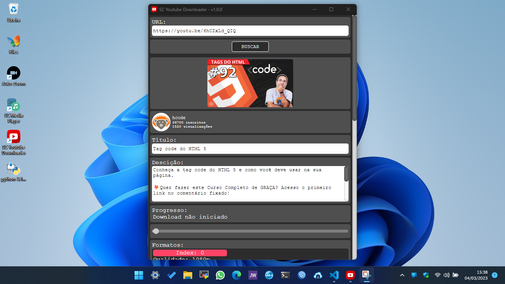

# Youtube Downloader

## 🏗️ Em obras

> App feito com Electron para baixar videos individuais ou playlists do youtube em vários formatos

## FAQ

### Por que o download tá tão lento?

> A velocidade de download ao usar a biblioteca `ytdl-core` pode variar dependendo de vários fatores, como a qualidade do vídeo selecionada, o tamanho do vídeo, a largura de banda da internet e a capacidade do processador do seu dispositivo.
>
> A biblioteca `ytdl-core` é uma das bibliotecas mais populares para baixar vídeos do YouTube usando Node.js. No entanto, é importante observar que ela não é oficialmente suportada pelo YouTube e pode haver limitações no acesso às informações do vídeo e no processo de download.
>
> Além disso, a velocidade de download pode ser afetada pelo uso de proxies, firewalls e outros dispositivos de rede que podem limitar a velocidade de conexão.
>
> Se a velocidade de download estiver muito lenta, pode ser útil verificar a qualidade do vídeo selecionada e a velocidade da conexão à internet. Também pode ser útil experimentar outras bibliotecas de download de vídeo para comparar a velocidade de download.
